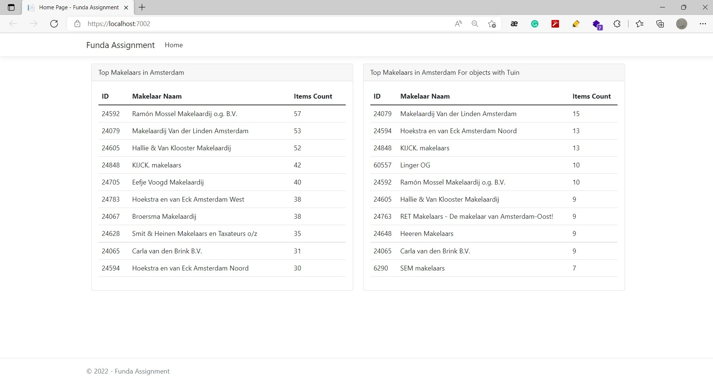

# Funda Assignment
This is an assignment for funda .Net developer role 
## TL;DR

This is a little bit weird to me. I don't usually write my thoughts about the code as a markdown, piece of paper is much preferred. Since this repo is going to reveal my skills to funda guys, I put everything comes to my mind about the assignment here.

## Purpose
This project shows top makelaars (Real states) in Amsterdam. We have 2 makelaars list:
 - Top 10 Makelaars in Amsterdam with most objects for sale
 - Top 10 Makelaars in Amsterdam with most objects with tuin (garden) for sale

## Where we are standing and what we are supposed to do?

 - We have an API endpoint using that we can retrieve all objects listed for sale in Amsterdam

 - There is an API throttling limiting the number of requests to <=100 per minute

- We need to avoid errors related to API calls

- The solution should be testable

- Separation of concerns is important


## Final Result


## Configurations
API configurations are placed in [/FundaAssignment.WebApp/appsettings.json](/FundaAssignment.WebApp/appsettings.json) under `FundaApiConfiguration` section

```json
{
  ...
  "FundaApiConfiguration": {
    "BaseUrl": "http://partnerapi.funda.nl/feeds/Aanbod.svc/json",
    "ApiKey": "ac1b0b1572524640a0ecc54de453ea9f",
    "ThroughputPerMinute": 100,
    "RetryOnFailCount": 3
  }
}
```

## Notes
- This project does not use any storage to keep data persistent. Each time the application starts, it calls funda API to fill initial data. It makes initialization a little bit longer than usual. 
- If the number of objects in API increases that we can't fetch them all in 100 requests, the initial load would take longer than a minute.
- There is a background task in [/FundaAssignment.WebApp/Services/FundaObjectSynchronizerService.cs](/FundaAssignment.WebApp/Services/FundaObjectSynchronizerService.cs) working to sync the assignment data with data in the funda API. It refreshed local data every 5 minutes.
- More advanced Http Client policies like retry with exponential back-off could be applied to better handle API errors, but for this particular scenario with assignment purpose, current policy is enough. policy configuration placed here: [/FundaAssignment.WebApp/Extensions/FundaHttpClientExtensions.cs](/FundaAssignment.WebApp/Extensions/FundaHttpClientExtensions.cs) 